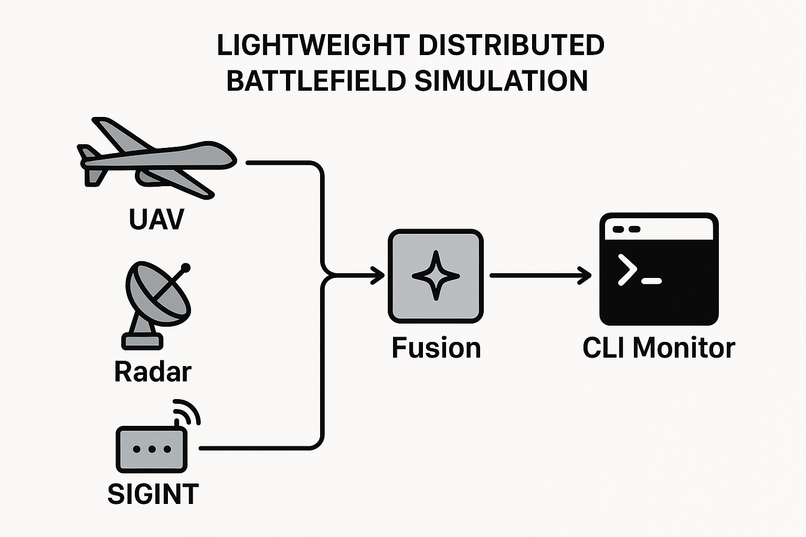
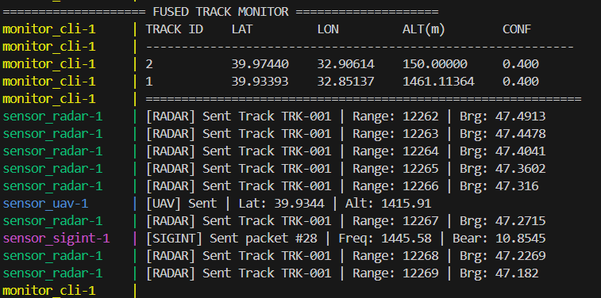

# Distributed Battlefield Simulator

This repository implements a lightweight distributed battlefield simulation composed of simulated sensors (UAV, Radar, SIGINT), a fusion service that ingests sensor streams and produces fused tracks, and a small CLI monitor that subscribes to fused tracks for real-time observation.



Example output:



---

## Project Overview

- **Sensors**: Simulators that stream telemetry/detections to the fusion service. Implemented in C++.
- **Fusion service**: Central gRPC server that accepts sensor streams, fuses incoming detections into `FusedTrack` objects and exposes a monitor API.
- **Monitor CLI**: Terminal UI that subscribes to fused tracks and prints a human-readable table.
- **Protobuf**: All messages and RPC interfaces are defined in `proto/`.

The design favors clarity and a minimal implementation of sensor fusion for demonstration and development.

## Repository Layout

Top-level layout (key files and folders):

- `CMakeLists.txt` - Top-level CMake configuration which generates protobuf sources and configures subprojects.
- `docker-compose.yml` - Development compose file to build and run the system containers.
- `proto/` - All `.proto` files, organized into `common/`, `sensors/`, and `fusion/`.
- `services/` - Service implementations:
  - `fusion_service/` — fusion server (gRPC) and monitor backend
  - `sensor_uav/`, `sensor_radar/`, `sensor_sigint/` — sensor simulators
  - `monitor_cli/` — CLI monitor client
- `generated/` - Where protoc-generated `.pb.*` and `.grpc.pb.*` files are placed by the build (or can be pre-populated).
- `docker/` - Dockerfile(s) used by `docker-compose.yml`.

See `project_structure.txt` for a human-friendly tree (included in the repo).

## Protobuf API Summary

All protobuf definitions are under `proto/`.

- `common/header.proto`
  - `Header` : common metadata (timestamp, sensor_id)

- `common/geo.proto`
  - `GeoPoint` : `lat`, `lon`, `alt`

- `sensors/*.proto`
  - `UAVTelemetry` : UAV position, speed, heading, status
  - `RadarDetection` : radar track id, range, bearing, elevation, rcs, velocity
  - `SigintHit` : frequency, power, confidence, bearing

- `fusion/fusion.proto`
  - `FusionService` : streaming RPCs for `StreamUAV`, `StreamRadar`, `StreamSigint` (sensors stream to fusion service)
  - `FusionMonitor` : `SubscribeFusedTracks` RPC that returns a stream of `MonitorResponse` containing `FusedTrack` messages
  - `FusedTrack` : `track_id`, `position` (`GeoPoint`), `velocity`, `heading`, `confidence`, `source_sensors`

The top-level `fusion` service exposes both ingestion streams (for sensors) and a readonly monitor API for UIs/CLI.

## High-level Architecture

1. Sensor simulators open gRPC streams to the fusion server and continuously send messages.
2. Fusion server receives streams, updates an internal track buffer, runs a simple fusion algorithm (averaging / basic heuristics) and updates fused tracks.
3. Monitor API reads fused tracks (protected with a shared mutex) and serves them to subscribers (e.g., `monitor_cli`).

The fusion implementation is intentionally simple and deterministic; it's a good starting point to replace or extend with Kalman filters, multiple-hypothesis trackers, or probabilistic data association.

## Prerequisites

- CMake >= 3.15
- A C++17-capable compiler (g++/clang on Linux/macOS, MSVC on Windows)
- Protobuf compiler `protoc` and C++ protobuf runtime
- gRPC C++ (development headers and the `grpc_cpp_plugin` for `protoc`), or pre-generated files in `generated/`
- Docker & Docker Compose (optional, used for quick dev environment)

On Windows you can install these using vcpkg, MSYS2, or native installers. On Debian/Ubuntu you can install protobuf and grpc packages or build from source.

## Run Using Docker Compose (recommended for quick setup)

The repo includes a `docker/dev.Dockerfile` and `docker-compose.yml` that build a single image and run each service with different entrypoints. From the repo root:

```powershell
docker-compose up --build

# To run in background
docker-compose up --build -d

# View logs for a service
docker-compose logs -f fusion_service
```

The compose file wires the services and exposes ports:

- Fusion service (gRPC ingestion): `6000`
- Fusion monitor API: `6005`

`monitor_cli` in the compose file connects to `fusion_service:6005` and prints fused tracks.


## Development Notes

- The fusion algorithm in `services/fusion_service/src/fusion_service.cpp` is intentionally simple: it averages positions from UAV and Radar and increases confidence if SIGINT is present. It uses a single shared mutex to protect fused tracks.
- Monitor server (`services/fusion_service/src/fusion_monitor.cpp`) reads the same `fused_tracks_` map and returns a single `MonitorResponse` with the current tracks.

## Extending the Project

- Replace the simple averaging fusion with an Extended Kalman Filter or other tracker (see `docs/FUSION_MATH.md` if present).
- Improve track association: current demo assigns static track IDs; integrate real track-id parsing or a data association module.
- Add persistent storage, metrics endpoint, or an HTTP gateway to expose fused tracks to web UIs.