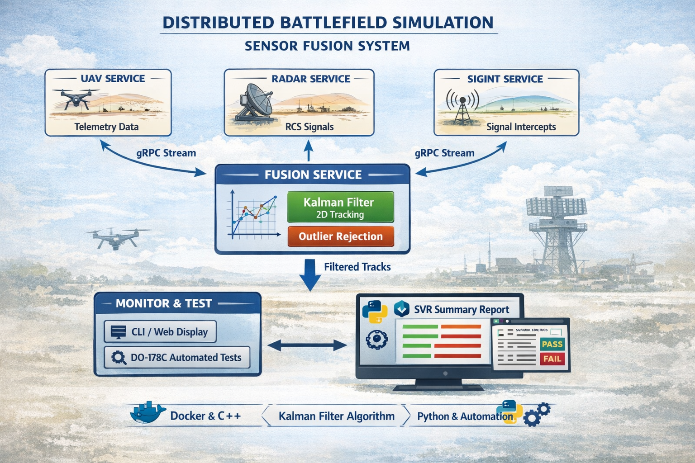

# Distributed Battlefield Simulation - Sensor Fusion System

## Overview

**Battlefield-Sim** is a distributed simulation framework for testing multi-sensor fusion algorithms in contested environments. It simulates a network of heterogeneous sensors (radar, UAV telemetry, SIGINT) that stream real-time measurements to a gRPC-based fusion service, which applies a Kalman filter to produce high-accuracy position estimates even under degraded conditions.

The system is containerized using Docker/Docker Compose and includes an automated test framework (following DO-178C standards) for validating fusion accuracy and convergence.

---

## System Architecture



### Key Components

| Component | Purpose | Technology |
|-----------|---------|-----------|
| **UAV Service** | Simulates aerial platform GPS/INS telemetry | C++, gRPC |
| **Radar Service** | Multi-element radar with dynamic RCS model | C++, gRPC, Physics |
| **SIGINT Service** | Electronic signal detection and localization (simulated; not currently fused) | C++, gRPC |
| **Fusion Service** | Real-time Kalman filtering & track fusion | C++, OpenCV, gRPC |
| **Monitor Service** | Real-time fusion state visualization | C++, gRPC |
| **Auto-Simulation** | DO-178C test framework & reporting | Python 3, Docker Compose |

---

## Getting Started

### Prerequisites

- **Docker & Docker Compose** (v2.0+)
- **Python 3.8+** (for test automation)
- **CMake 3.15+** (for local C++ builds)

### Quick Start

#### 1. Build & Run All Services

```bash
# Build Docker image
docker compose build

# Start all services (runs indefinitely; Ctrl+C to stop)
docker compose up
```

#### 2. Run Automated Test Suite

```bash
# Execute DO-178C test suite (5 test cases, ~2-3 minutes)
python auto_simulation.py

# Output: simulation_results/batch_YYYYMMDD_HHMMSS/SVR_Summary_Report.txt
```

---

## How It Works

### The Simulation Loop

1. **Sensor Services** → Read ground truth file, apply sensor models (noise, RCS), send measurements via gRPC.
2. **Fusion Service** → Buffer incoming measurements, apply Kalman predict/update cycle at 100ms cadence.
3. **Monitor Service** → Export fused tracks on-demand to CLI or log files.
4. **Test Script** → Capture CSV output, compute accuracy metrics, generate report.

---

## Requirements & Verification

The requirements engine is defined in `requirements.py`:

### Three Core SRIDs (Software Requirement IDs)

| SRID | Metric | Threshold | Check |
|------|--------|-----------|-------|
| **SRID-FUS-001** | Steady-state average error | **< 25 m** | Mean of errors after 10s convergence |
| **SRID-FUS-002** | Peak error (no spikes) | **< 100 m** | Max error after convergence |
| **SRID-FUS-003** | Convergence time | **< 10 s** | Time to drop below 20m |

## Example Output Report

### SVR_Summary_Report.txt

```
======================================================================
SOFTWARE VERIFICATION RESULTS (SVR) - BATCH 20260103_003818
DATE: 2026-01-03 00:42:30
======================================================================

TEST CASE: TC-ACC-01 [PASS]
Scenario : nominal_speed_50ms
------------------------------
  SRID-FUS-001: Measured=21.11 | Average Error < 25.0m -> [PASS]
  SRID-FUS-002: Measured=75.68 | Peak Error < 100.0m -> [PASS]
  SRID-FUS-003: Measured=0.2 | Convergence Time < 10.0s -> [PASS]

TEST CASE: TC-ACC-02 [PASS]
Scenario : high_speed_250ms
------------------------------
  SRID-FUS-001: Measured=14.15 | Average Error < 25.0m -> [PASS]
  SRID-FUS-002: Measured=38.29 | Peak Error < 100.0m -> [PASS]
  SRID-FUS-003: Measured=0.1 | Convergence Time < 10.0s -> [PASS]

TEST CASE: TC-ACC-03 [PASS]
Scenario : interceptor_300ms
------------------------------
  SRID-FUS-001: Measured=14.22 | Average Error < 25.0m -> [PASS]
  SRID-FUS-002: Measured=38.61 | Peak Error < 100.0m -> [PASS]
  SRID-FUS-003: Measured=0.0 | Convergence Time < 10.0s -> [PASS]

TEST CASE: TC-GEO-01 [FAIL]
Scenario : north_approach
------------------------------
  SRID-FUS-001: Measured=19952.14 | Average Error < 25.0m -> [FAIL]
  SRID-FUS-002: Measured=32097.97 | Peak Error < 100.0m -> [FAIL]
  SRID-FUS-003: Measured=0.0 | Convergence Time < 10.0s -> [PASS]

TEST CASE: TC-GEO-02 [FAIL]
Scenario : diagonal_approach
------------------------------
  SRID-FUS-001: Measured=52.66 | Average Error < 25.0m -> [FAIL]
  SRID-FUS-002: Measured=192.1 | Peak Error < 100.0m -> [FAIL]
  SRID-FUS-003: Measured=14.5 | Convergence Time < 10.0s -> [FAIL]
```

**Interpretation:**
- ✅ **Accuracy Tests (TC-ACC-01/02/03)** all pass — fusion tracks static and moving targets well at various speeds.
- ❌ **Geographic Tests (TC-GEO-01/02)** fail — indicates a north/diagonal bearing bias; likely due to coordinate reference frame mismatch or sensor alignment issue.

---

## Sensor Models

### Radar Service (Dynamic RCS)

The radar simulator includes a realistic RCS (Radar Cross Section) model:

```cpp
// Aspect angle = difference between UAV heading and bearing from radar
double CalculateAspectRCS(double uav_lat, double uav_lon, double uav_heading,
                          double radar_lat, double radar_lon)
{
    double bearing_to_uav = geo_utils::BearingDegrees(radar_lat, radar_lon, 
                                                       uav_lat, uav_lon);
    double alpha_rad = abs(uav_heading - bearing_to_uav) * PI / 180.0;

    // RCS model: frontal = 0.1 m², side = 2.0 m²
    double rcs_min = 0.1;
    double rcs_max = 2.0;
    return rcs_min * cos²(alpha) + rcs_max * sin²(alpha);
}

// Signal strength = RCS / range⁴ (inverse square × propagation path)
double signal_strength = rcs / pow(range, 4);

// Detection threshold: signal_strength > RADAR_SENSITIVITY
if (signal_strength > 1e-12) { /* Detect target */ }
```
**Environment Variables (docker-compose.yml):**

### Additional Radar Physics Checks

The radar simulator now performs several additional physical checks before declaring a detection:

- Rain attenuation: uses a simplified ITU-R model to compute two-way loss (dB) and applies it as a linear attenuation factor to the received signal.
- Signal strength composition: final detection test uses composite signal = (RCS * antenna_gain_linear) / range^4 * weather_factor.
- Doppler / range-rate: range-rate based checks were removed from the sensor-side (UAV speed is not a reliable environment parameter); any Doppler or radial-velocity estimation should be performed/validated on the fusion side.

These checks are implemented in `services/common_utils/physics.{h,cpp}` and exercised by `sensor_radar` when `RADAR_RCS_ACTIVE` is enabled.

**Environment Variables (docker-compose.yml):**
```yaml
services:
  sensor_radar:
    environment:
      RADAR_ID: "TPS-77-LONG-RANGE"
      RADAR_LAT: 39.90
      RADAR_LON: 32.80
      RADAR_SENSITIVITY: 1e-12
      RADAR_RANGE_SIGMA: 30.0          # Measurement noise (meters)
      RADAR_BEARING_SIGMA: 1.0          # Bearing noise (degrees)
      RADAR_RCS_ACTIVE: "true"          # Enable dynamic RCS
```

### Kalman Filter (Fusion Service)

2D constant-velocity Kalman filter:

```
State vector: [lat, lon, v_lat, v_lon]
Measurement: [lat, lon]

Prediction: x = F·x + w  (process noise Q)
Update:     x = x + K·(z - H·x)  (measurement noise R)

Adaptive R: If innovation > 1000m (outlier), increase R to desensitize.
```

---

## Configuration

### Environment Variables

#### Global (docker-compose.yml)

```yaml
environment:
  SIM_DURATION_SEC: 30              # How long each test runs
  FUSION_ADDR: "fusion_service:6000"  # Fusion service endpoint
  SHARED_TRUTH_PATH: "/workspace/shared/ground_truth.txt"
  SHARED_LOG_PATH: "/workspace/shared/logs"
```

#### Sensor-Specific

```bash
# UAV
UAV_SPEED: 50.0           # m/s
UAV_LAT: 39.93            # degrees
UAV_LON: 32.86            # degrees
UAV_HEADING: 90.0         # degrees (0=North, 90=East)

# Radar
RADAR_ID: "TPS-77-LONG-RANGE"
RADAR_SENSITIVITY: 1e-12  # Minimum detectable signal
RADAR_RCS_ACTIVE: "true"  # Use realistic RCS model

```

---

## Directory Structure

```
Battlefield-Sim/
├── CMakeLists.txt              # Main build configuration
├── docker-compose.yml          # Multi-container orchestration
├── docker/
│   └── dev.Dockerfile          # Development container image
├── proto/                       # Protocol Buffer definitions
│   ├── common/                  # Shared message types
│   ├── fusion/                  # Fusion RPC definitions
│   └── sensors/                 # Sensor message schemas
├── generated/                   # Auto-generated proto C++ code
├── services/
│   ├── common_utils/            # Shared utilities (geometry, physics, config)
│   │   ├── geo_utils.h/cpp      # Haversine distance, bearing calculation
│   │   ├── physics.h/cpp        # RCS aspect angle, signal strength
│   │   └── config.h/cpp         # Environment variable parsing
│   ├── fusion_service/          # Primary fusion engine
│   ├── sensor_radar/            # Radar simulator
│   ├── sensor_uav/              # UAV telemetry generator
│   ├── sensor_sigint/           # SIGINT emulator
│   └── monitor_cli/             # CLI monitoring tool
├── logs/                        # Shared volume for fusion outputs
├── simulation_results/          # Batch test outputs
├── auto_simulation.py           # Test framework orchestrator
├── requirements.py              # Scalable requirements engine
└── README.md                    # This file
```

---

## CI/CD Pipeline

This project includes an automated **GitHub Actions CI/CD pipeline** for continuous integration and deployment.

### Quick Start

For detailed CI/CD documentation, see [.github/QUICK_START.md](.github/QUICK_START.md) or [.github/GITHUB_ACTIONS_SETUP.md](.github/GITHUB_ACTIONS_SETUP.md).

### Workflows Overview

#### 1. **CI/CD Pipeline** (Automatic on push/PR)
Runs on every push to `main` or `develop` branches and on pull requests:

```
Build Phase:
  ├─ Install dependencies (Protobuf, gRPC, Abseil)
  ├─ Compile C++ project with CMake
  ├─ Store binaries as artifacts
  └─ Build Docker image

Test Phase:
  ├─ Run Docker Compose
  ├─ Execute simulation test suite
  ├─ Verify test results
  └─ Archive logs and test outputs

Quality Checks:
  ├─ Code linting (flake8)
  ├─ Format validation (black, isort)
  └─ Security scan (Trivy)
```

#### 2. **Release Pipeline** (Automatic on version tag)
Triggers when you push a git tag matching `v*.*.*`:

```bash
git tag -a v1.0.0 -m "Release version 1.0.0"
git push origin v1.0.0
```

Actions:
- Creates GitHub Release page with changelog
- Publishes Docker image to GitHub Container Registry with semantic version tag
- Uploads source code archives (.tar.gz, .zip)

#### 3. **PR Checks** (Automatic on pull request)
Validates pull requests before merging:

- Commit message format (Conventional Commits)
- File size limits (max 50MB)
- Proto and CMake configuration integrity
- Dependency checks

### Using Pre-built Docker Images

After CI/CD publishes an image:

```bash
# From main branch (latest development build)
docker pull ghcr.io/your-username/battlefield-sim:main

# From specific release
docker pull ghcr.io/your-username/battlefield-sim:v1.0.0

# Run services
docker compose up
```

### Monitoring CI/CD Status

1. Navigate to your repository
2. Click **Actions** tab to view all workflow runs
3. Click individual workflows to see detailed logs
4. Check **Releases** tab for published versions
5. Check **Packages** tab for published Docker images

### Common CI/CD Commands

```bash
# Create a feature branch (triggers PR checks when pushed)
git checkout -b feature/my-feature
git add .
git commit -m "feat: add new sensor"
git push origin feature/my-feature
# → Open PR on GitHub

# Merge to main (triggers full CI/CD pipeline)
git checkout main
git pull origin main
git merge feature/my-feature
git push origin main
# → CI builds, tests, and publishes Docker image

# Create a release
git tag -a v1.0.0 -m "Release version 1.0.0"
git push origin v1.0.0
# → CI publishes release with Docker image and archives
```

### Troubleshooting CI/CD

**Build fails:**
- Check logs in Actions tab
- Verify `CMakeLists.txt` and `dev.Dockerfile` are correct
- Ensure all dependencies are available

**Tests timeout:**
- Increase timeout value in workflow files
- Check `SIM_DURATION_SEC` environment variable

**Docker image not published:**
- Ensure you have write access to GitHub Container Registry
- Verify branch/tag naming follows workflow trigger rules

For detailed troubleshooting, see [.github/GITHUB_ACTIONS_SETUP.md](.github/GITHUB_ACTIONS_SETUP.md#troubleshooting).

---
