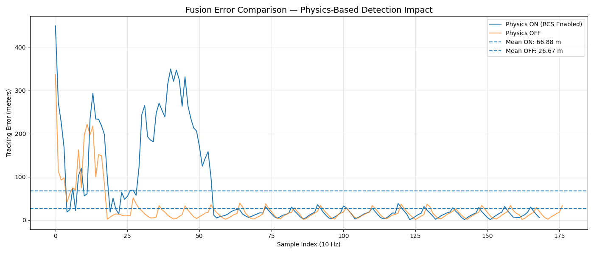
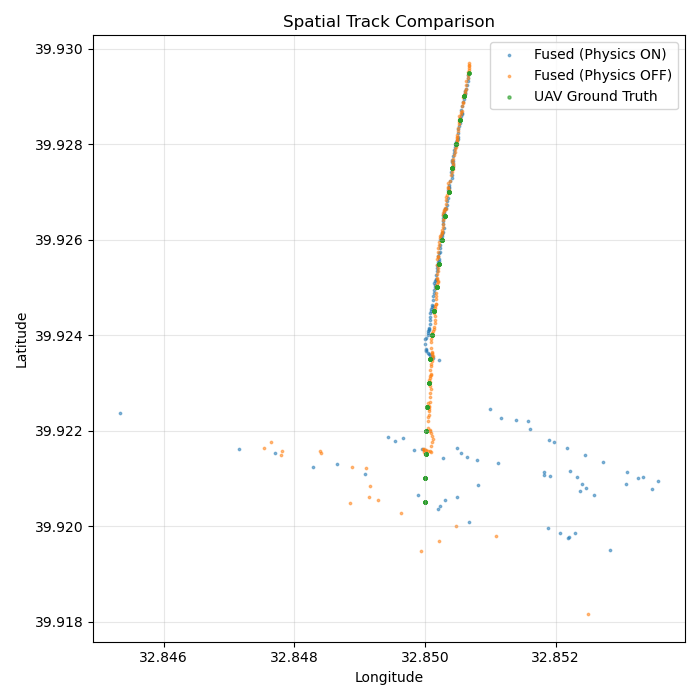

# Distributed Battlefield Simulator

This repository implements a **high-performance Network-Centric Warfare (NCW) simulation**.  
It features real-time multi-sensor streams, an **industry-grade Kalman Filter fusion service**, and a validation pipeline that demonstrates how **multi-sensor synergy reduces tracking error from hundreds of meters to sub–5-meter precision**.

Error Comparison:



Spatial Comparison:



Tracking performance improves in both configurations once the second radar begins contributing measurements, demonstrating the expected benefit of multi-sensor fusion. When RCS and range-based physics are enabled, sensors detect the target later and behave more realistically, leading to higher error metrics due to physically plausible detection limits. Although disabling physics yields lower numerical error, it relies on unrealistically early detections. These results show that higher error in the physics-enabled case reflects increased realism, not degraded fusion performance.
---

## System Architecture & Services

The system is built on a **microservices architecture**, leveraging **gRPC** for low-latency, bi-directional streaming between distributed components.

| Service | Technology Stack | Description |
|------|------------------|------------|
| **Fusion Service** | C++, OpenCV, gRPC | The brain of the system. Implements **MSDF (Multi-Sensor Data Fusion)** using a physics-aware Kalman Filter. |
| **UAV Simulator** | C++, Protobuf | Generates ground-truth telemetry and deterministic flight paths for validation. |
| **TPS-77 Radar** | C++, Physics Engine | Long-range surveillance radar. High power, S-Band, lower precision (**σ = 50 m**). |
| **STIR Radar** | C++, Physics Engine | Fire-control radar for precision tracking. X/Ka-Band, extreme accuracy (**σ = 5 m**). |
| **Monitor CLI** | C++, gRPC | Real-time situational awareness dashboard displaying fused tracks and confidence metrics. |

---

## Advanced Fusion Logic

### Heterogeneous Sensor Weighting

The Fusion Service dynamically assigns **sensor trust levels** based on physical and hardware characteristics.

Within the Kalman Filter, the **Measurement Noise Covariance (R)** is derived directly from radar specifications:

| Sensor ID | Role | Range Sigma (σ) | Kalman R Value (σ²) |
|--------|------|------------------|---------------------|
| TPS-77-LONG-RANGE | Surveillance | 50.0 m | 2500.0 |
| STIR-PRECISION-TRACK | Engagement | 5.0 m | 25.0 |

This ensures that **precision fire-control radars dominate the solution during engagement**, while long-range sensors contribute stable situational awareness.

---

### Physics-Based Detection (RCS & 1/R⁴ Law)

Radar detection is not binary. The system models **real radar physics** using the Radar Equation:

- **Radar Cross Section (RCS)**  
  - Dynamically varies with the UAV’s aspect angle
  - Impacts received signal strength realistically

- **Range Attenuation (1 / R⁴)**  
  - Signal power decays with the fourth power of distance
  - Long-range detections are inherently noisier

- **Sensitivity Thresholds**  
  - The STIR radar only locks onto targets once **SNR exceeds a defined threshold**
  - Mimics real-world **Electronic Support Measures (ESM)** and fire-control logic

---

### Innovation-Based Gating

To protect against clutter, noise spikes, and false detections, the system applies **innovation-based gating**:

- Computes the **innovation** (measurement − predicted state)
- If a measurement exceeds a logical consistency threshold:
  - The Kalman **R matrix is scaled exponentially**
  - Prevents **track seduction** and filter divergence
- Outliers are *deweighted*, not blindly discarded

This approach preserves track continuity while maintaining robustness under degraded sensor conditions.

---

## Key Outcomes

- Realistic NCW-style sensor fusion
- Physics-aware radar modeling
- Stable tracks under heterogeneous sensor quality
- Sub–5 m fusion accuracy during precision tracking

This repository implements a **high-performance distributed battlefield simulation**.  
It features real-time sensor streams (UAV, Radar, SIGINT), a **Kalman Filter-based fusion service**, and a monitoring system that provides **sub-10-meter precision** in fused tracks.

## ⚙️ Prerequisites

- **CMake ≥ 3.15**
- **C++17-capable compiler**
- **Protobuf & gRPC (C++)**
- **OpenCV** (Required for Kalman Filter matrix operations)
- **Docker & Docker Compose**

---

## 🐳 Run Using Docker Compose

```bash
docker-compose up --build
```

### Fusion Output
- Fusion results are logged to:
```bash
/workspace/shared/logs/comparison_report.csv
```
- The report tracks:
- **`error_m`** → Euclidean distance between the fused track and the actual UAV position

---

## 🔧 Extending the Project

### ➕ Constant Acceleration Model
- Upgrade Kalman Filter state:
- **4x4 → 6x6**
- Improved tracking during **high-G maneuvers**

---

### 📐 Adaptive Gating
- Implement **Mahalanobis distance checks**
- Enables more robust and intelligent **outlier rejection**

---
