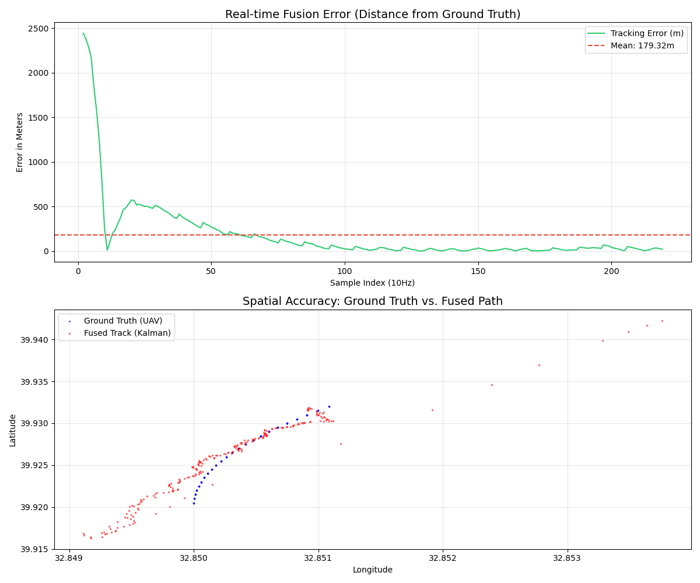

# Distributed Battlefield Simulator

This repository implements a **high-performance distributed battlefield simulation**.  
It features real-time sensor streams (UAV, Radar, SIGINT), a **Kalman Filter-based fusion service**, and a monitoring system that provides **sub-10-meter precision** in fused tracks.

Example output:



Performance Analysis:
The system achieves a significant precision boost by fusing multi-radar data. After the initial Kalman convergence, the average tracking error stays within 10-15 meters, even with noisy Radar sensors ($\sigma=35$).

---

## 📌 Project Overview

### Sensors
- High-fidelity simulators streaming telemetry and detections via **gRPC**
- Supported sensors:
  - UAV (Ground Truth)
  - Radar (Configurable noise levels)
  - SIGINT (Planned)

### Fusion Service
- C++ **gRPC server**
- Performs **Multi-Sensor Data Fusion (MSDF)**
- Uses a **Linear Kalman Filter** with **dynamic noise scaling**

### Monitor CLI
- Real-time **terminal UI**
- Displays fused tracks and system confidence

### Protobuf
- Structured message definitions
- Ensures **type safety** across the distributed system

---

## 🚀 New Features (Latest Updates)

### Kalman Filter Integration
- It uses a **constant-velocity Kalman Filter**

### Dynamic Origin Calculation
- Sensors now report their **own GPS positions**
- Fusion service performs real-time **coordinate transformations**
  - Polar → Geographic
  - Each sensor has a unique perspective

### Outlier Rejection (Gating)
- Dynamic measurement noise scaling (`R`)
- Penalizes sensors with high **innovation error**

### Comparative Logging
- Automatic generation of `comparison_report.csv`
- Measures fusion error against **ground-truth UAV data**


---

## 🧠 High-Level Architecture

### Ingestion
- Sensors open **gRPC streams** to the fusion server

### Processing (10 Hz)
1. **Predict**
   - Kalman Filter projects next position using velocity
2. **Update**
   - Multi-radar detections fused using weighted covariance
3. **Coordinate Sync**
   - Radar polar coordinates converted to GeoPoints
4. **Subscription**
   - Monitor CLI subscribes via `FusionMonitor` API

---

## ⚙️ Prerequisites

- **CMake ≥ 3.15**
- **C++17-capable compiler**
- **Protobuf & gRPC (C++)**
- **OpenCV** (Required for Kalman Filter matrix operations)
- **Docker & Docker Compose**

---

## 🐳 Run Using Docker Compose

```bash
docker-compose up --build
```

---

## 🚀 Services Started Automatically

| Service        | Port(s) / Description |
|---------------|------------------------|
| Fusion Service | `6000` (Ingestion) / `6005` (Monitor) |
| RADAR-1       | High Precision Radar |
| RADAR-2       | Medium Precision Radar |
| UAV           | Ground-truth telemetry @ **1 Hz** |

---

## 📈 Performance Analysis

Sensor weighting is applied based on reported measurement error:

| Sensor  | Measurement Noise (R) |
|--------|------------------------|
| RADAR-1 | 400 |
| RADAR-2 | 1225 |

### 📊 Fusion Output
- Fusion results are logged to:
```bash
/workspace/shared/logs/comparison_report.csv
```
- The report tracks:
- **`error_m`** → Euclidean distance between the fused track and the actual UAV position

---

## 🔧 Extending the Project

### ➕ Constant Acceleration Model
- Upgrade Kalman Filter state:
- **4x4 → 6x6**
- Improved tracking during **high-G maneuvers**

---

### 📐 Adaptive Gating
- Implement **Mahalanobis distance checks**
- Enables more robust and intelligent **outlier rejection**

---
